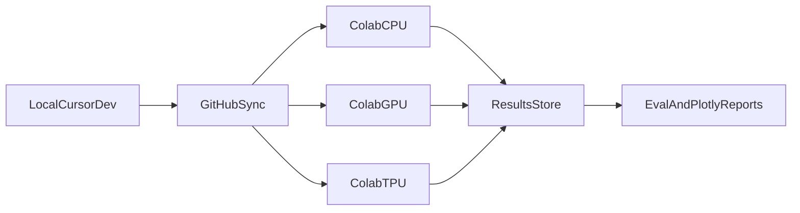

# Refined Plan: Flax/Flash KMeans Project

## Critical Review Outcomes (from your draft)

- The phase sequence is solid, but naming and success criteria need tightening to avoid drift.
- Environment notes were contradictory (GPU vs TPU). Plan should define a device matrix by experiment type instead of one global target.
- Evaluation metrics listed (F1/Precision/Recall/ROC-AUC) are classification-first and not appropriate as core clustering metrics.
- Experiment workflow should avoid manual code copy; GitHub sync into Colab is more reproducible and less error-prone.
- Early project success depends on repo structure, baseline scripts, and tracking conventions, not just model code.

## Locked Decisions

- Prioritize correctness and reproducibility first, then optimize performance.
- Use local Cursor development plus Colab via GitHub sync for experiments.
- Use unsupervised clustering metrics as core.
- Start with synthetic suite plus 2 real datasets in v1 benchmark scope.

## Recommended Project Structure

- `src/data/` (synthetic + real dataset loaders)
- `src/algorithms/` (jax_kmeans, jax_flash_kmeans, sklearn_kmeans, flashkmeans_wrapper)
- `src/eval/` (metrics + benchmark runners)
- `src/plots/` (plotly theme + chart builders)
- `configs/` (dataset and experiment configs)
- `notebooks/` (Colab-oriented notebooks)
- `results/` (run artifacts and summaries)

Guidelines:
- Keep implementation mostly functional first; introduce classes only where shared state/config materially reduces duplication.
- Keep one implementation per module to make comparisons explicit and reduce coupling.

## Environment and Tooling Plan

- Use `uv` for env/dependency management and lockfile pinning.
- Define two reproducible execution profiles:
  - Local CPU profile for correctness tests and quick iteration.
  - Colab GPU/TPU profile for scale/perf runs.
- Enforce device checks at runtime (`cpu/gpu/tpu`) and fail loudly when mismatched.
- Add a minimal run manifest per experiment (seed, device, dataset, n_samples, n_features, k, timing metadata).

## Benchmark Design (v1)

- Synthetic datasets:
  - Gaussian blobs with controlled separation
  - Vary: sample size, dimensionality, number of clusters, imbalance, noise
- Real datasets (focused start):
  - Pen-Based Handwritten Digits (medium, labeled)
  - Wholesale Customers (small, business-style structure)
- Core metrics:
  - Quality: inertia, silhouette, Calinski-Harabasz, Davies-Bouldin
  - Performance: fit time, predict time, peak memory (where available), convergence iterations
- Record metrics in a single normalized results format for later plotting/comparison.

## Phase Plan

1. Phase A: Foundation setup
   - Repo structure, `uv` environment, lint/format/type/docstring baseline
   - Plot style system (pastel palette + consistent font stack)
2. Phase B: Correctness baselines
   - Implement JAX KMeans and sklearn KMeans
   - Validate equivalent behavior on small synthetic sets
3. Phase C: Flash implementations
   - Implement JAX flash-style variant and external flash-kmeans wrapper path
   - Validate parity on shared test inputs
4. Phase D: Benchmark harness
   - Add config-driven benchmark runner and artifact logging
5. Phase E: Comparative analysis
   - Generate final plots and summary tables; document tradeoffs by device and data scale

## Cursor and Documentation Strategy

- Use Cursor indexing/docs for targeted API lookup during implementation, not full-document ingestion.
- Keep a compact project docs list in-repo with links to:
  - `plans/initial_raw_thoughts.md`
  - `README.md`
  - JAX docs, flash-kmeans repo, flash-kmeans paper
- This keeps token use controlled while still grounding implementation decisions.

## Flow Overview

## Immediate Deliverables

- Refined plan document at `plans/refined_plan.md`.
- Initial experiment contract (config schema + results schema).
- Starter checklist in README for running local vs Colab workflows.

## Risks and Mitigations

- Device inconsistency across runs: enforce runtime device logging and assertions.
- Metric misuse for clustering: keep unsupervised metric set as mandatory core.
- Over-complex abstractions early: functional modules first, defer OOP where unnecessary.
- Colab environment drift: pin key versions and bootstrap via one setup cell/script.
